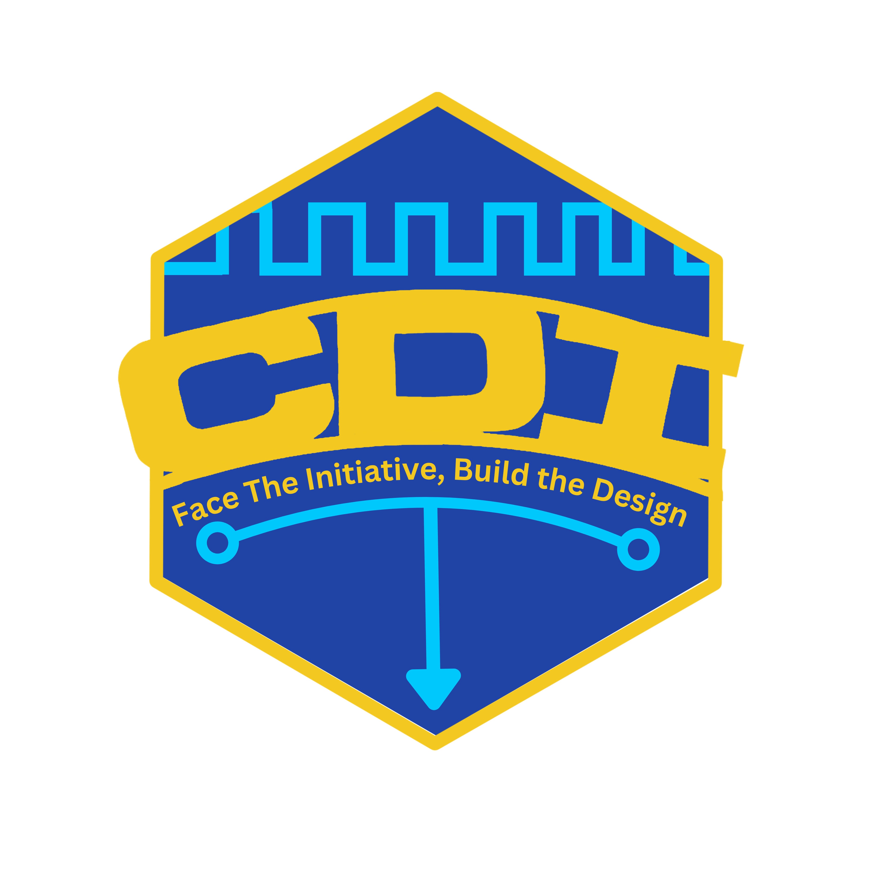

<!-- ## Im startin to like ts 😼 -->
<!-- # Chip Design Initiative  -->
<!-- ### The REal one -->
<!--  -->
<!---->
<!--

**Here are some ideas to get you started:**

🙋‍♀️ A short introduction - what is your organization all about?
🌈 Contribution guidelines - how can the community get involved?
👩‍💻 Useful resources - where can the community find your docs? Is there anything else the community should know?
🍿 Fun facts - what does your team eat for breakfast?
🧙 Remember, you can do mighty things with the power of [Markdown](https://docs.github.com/github/writing-on-github/getting-started-with-writing-and-formatting-on-github/basic-writing-and-formatting-syntax)
-->

  

<h3 align="left">Chip Design Initiative @ SJSU</h3>

Student led organization to develop embedded hardware, asic and much more.

## Opcodes:

0xpresident - @nicojeda189

## Initiative:

CDI Club is a student run club where we provide opprotunities for students to work on concepts and topics related to Chip Design and Circuit Design as a whole. Our club is quite small! so we aim after learning and projects to put on a resume and get into ASIC design. We have done PSOC workshops, FPGA workshops, and lots of open-source/free software!

## Goals!!!
The current goal is a TinyTapeout ready CPU, so a lot of project meetings will point toward digital design, RTL, Verilog, simulation, and all that junk. That does not mean the club is only Verilog though. I plan on doing KiCad, PSoCs, microcontroller based events and try our best to use open source or free tools whenever we can make them useful. If you have a personal project you really want to bring in, that is cool too, but the main club path is the shared TinyTapeout submission. If youre interesting in learning more or joining click the image below! 

## [Joining Us!](https://cdi-sjsu.github.io/join.html)

